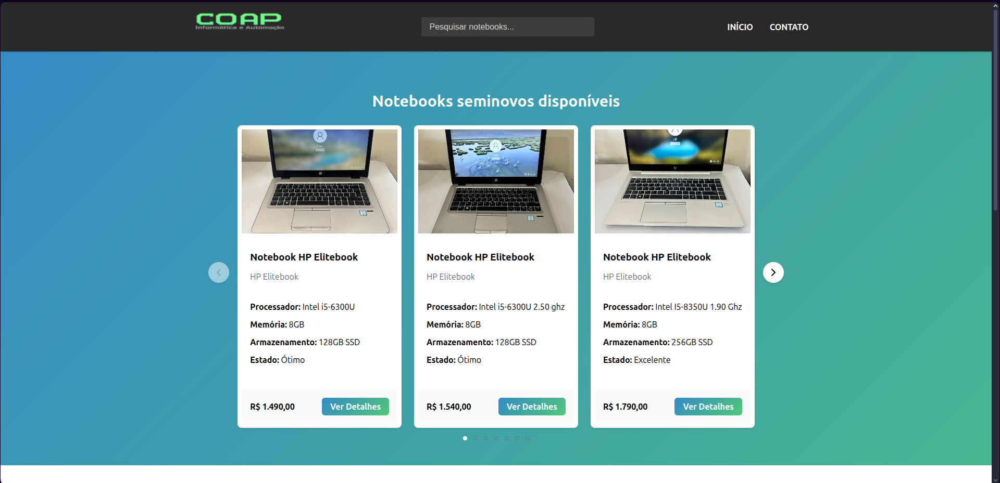

# 💻 COAP INFOTECH – Notebooks Seminovos

[](https://react.dev/)
[](https://www.framer.com/motion/)
[](https://heroicons.com/)
[](https://lucide.dev/)

---
Acesse o site: https://www.coapinfotech.com.br



---

## 🧠 Sobre o Projeto

**COAP INFOTECH** é uma aplicação web para venda e manutenção de notebooks seminovos, com foco em qualidade, transparência e facilidade de contato. O site oferece:

- 🎯 Catálogo de notebooks seminovos com detalhes e imagens
- 🖼️ Carrossel de produtos e avaliações de clientes
- 📱 Integração direta com WhatsApp para compra e suporte
- 📢 Seção de contato com redes sociais e formulário
- 💡 Interface moderna, responsiva e animada

---

## ⚙️ Tecnologias Utilizadas

### 🎨 Front-end (React)

| Biblioteca         | Finalidade                                      |
|--------------------|-------------------------------------------------|
| **React**          | Framework principal da interface SPA            |
| **React Router DOM** | Roteamento entre páginas                       |
| **Framer Motion**  | Animações suaves em carrosséis e transições     |
| **Heroicons**      | Ícones SVG modernos para UI                     |
| **Lucide React**   | Ícones adicionais e navegação                   |
| **@testing-library** | Testes de componentes e DOM                    |

---

## ▶️ Como Executar

```bash
# Instale as dependências
npm install

# Rode o projeto localmente
npm start
